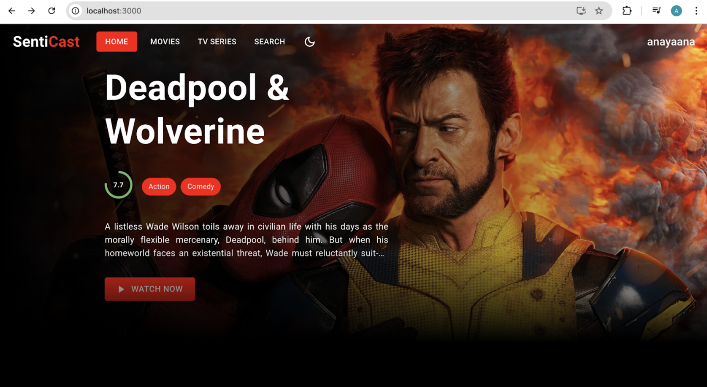
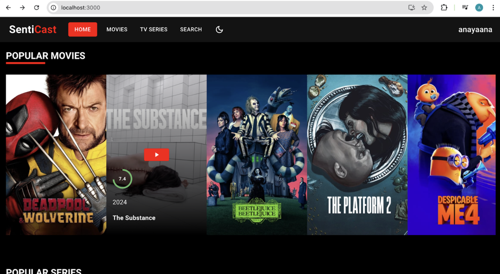
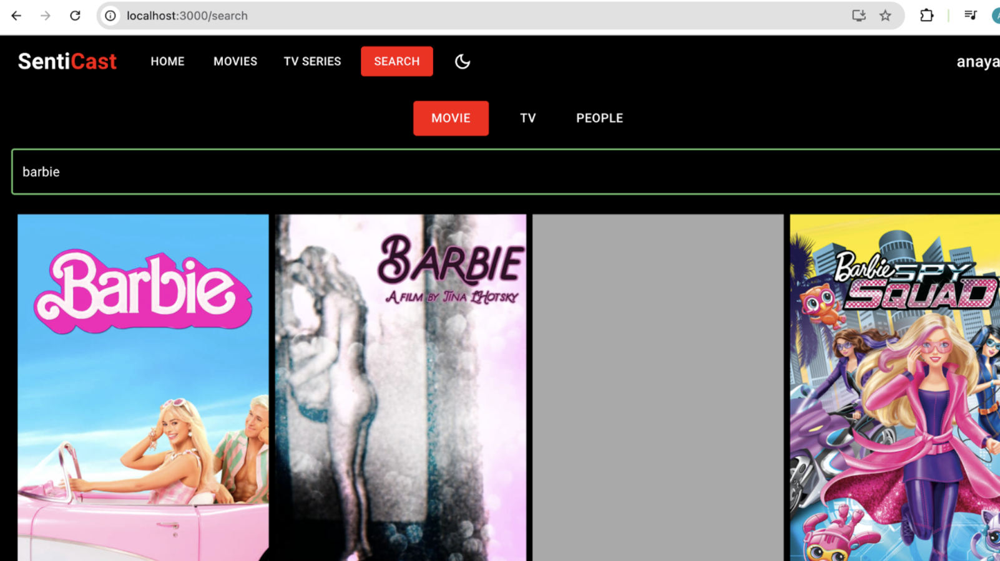
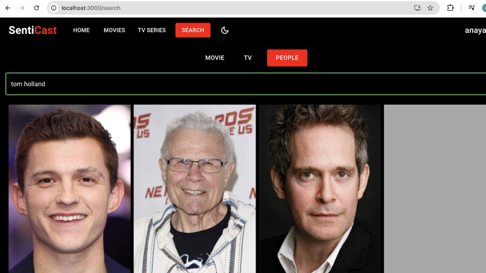
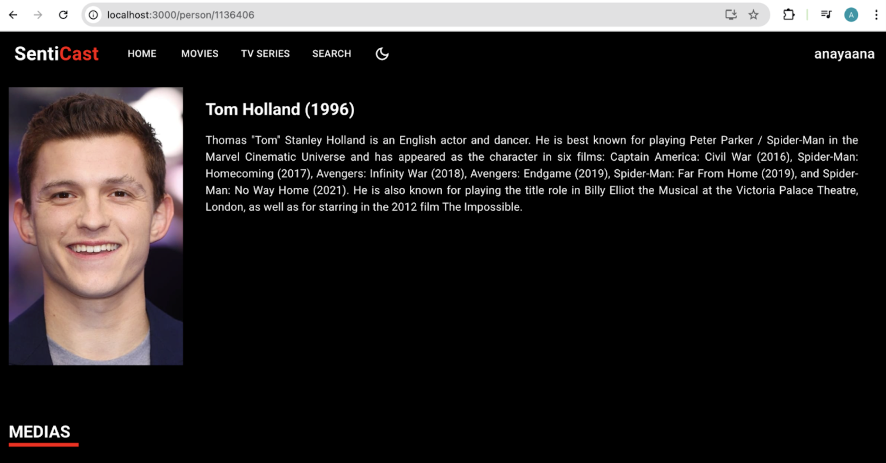

### SentiCast

SentiCast is a media streaming platform that incorporates an interactive comment section, a feature not available in major streaming platforms like Netflix and PrimeVideo. The platform features a personalized content recommendation system powered by content-based filtering with cosine similarity. It also performs sentiment analysis on user comments, initially tested with multiple models and ultimately optimized with an LSTM model for higher accuracy. The system enhances user interaction and engagement by providing personalized content suggestions based on user insights.

### App Preview







### Features

- **Sentiment Analysis**: Accurately classifies user comments, enhancing the interaction experience.
- **Content-Based Recommendations:** Personalized content suggestions based on user interactions.
- **Comment Section:** Users can engage with each other's opinions and feedback on content.
- **Add to Favorites:** Option to save favorite content for easy access and personalized recommendations.
- **Search Option:**  Allows users to search for movies, series, and people, making it easier to discover relevant content.

### Tech Stack

- **ReactJS:** For building a dynamic and interactive frontend interface.
- **NodeJS & ExpressJS:**  Backend framework for handling API requests and server-side logic.
- **MongoDB:** For scalable and flexible database management.
- **Python:**  Used for backend services and sentiment analysis model integration.
  
#### Libraries

- **LSTM:** For sentiment analysis.
- **Logistic Regression, LinearSVC, Random Forest:** For exploring sentiment analysis techniques.
- **Cosine Similarity:** For content-based recommendation.

### Dataset Used

- **TMDb API:** Movie data fetched from the TMDb API, including movie titles, genres, ratings, and release dates.
- **IMDb Dataset:** User reviews dataset from IMDb, used for sentiment analysis and recommendation system training.
  
### Getting Started

1. **Clone the Repository:**
   ```bash
   git clone https://github.com/arnavgholap/SentiCast.git
   ```

2. **Navigate to the Project Directory:**
   ```bash
   cd SentiCast
   ```

3. **Install Dependencies(for both client & server):**
   ```bash
   npm install
   ```
   
4. **Start the Application:**
   ```bash
   npm start
   ```
4. **Access the Application:**
   - Open your browser and go to http://localhost:3000 to start using SentiCast.

## Built With 🎯
**A lot of love and a little JavaScript**

### Contributing

Make Pull requests which improve the functionality of the application in any sorts. It should conform with the following conditions. 
* Clear , short , crisp description of the PR. 
* Should add on to the value of the application.

### License

MIT © [Arnav Gholap](https://github.com/arnavgholap)

- Special thanks to the open-source community for the tools and libraries used in this project.
- Grateful for the Kaggle dataset and TMDB that provided essential data for training the models.

### Acknowledgments 💖

* To my family👪  and friends 👫 who always kept me motivated.
* To the community of computer science 💻.

Made with ❤ by Arnav Gholap
